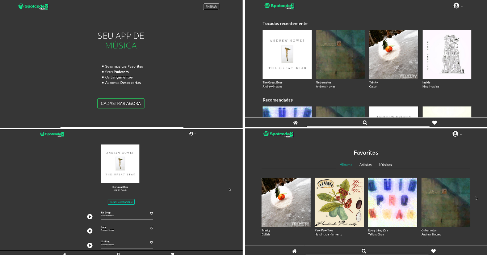

# SpotCode | OneBitCode

O projeto *"SpotCode"* é um PWA inspirado no Spotify usando Ruby On Rails e React, desde o planejamento até o App completamente funcional.

## Ambiente de desenvolvimento

As seguintes tecnologias foram utilizadas no projeto:

* Back-end
	* [Ruby on Rails](https://rubyonrails.org/)

* Front-end
	* [React](https://reactjs.org/)

## :boom: Desafios

1. Criar o component Artist

	* [ ] Exibir ele na busca

	* [ ] Exibir ele nos favoritos

2. Criar a página Artist

	* [ ] Mostrar os detalhes do artista

	* [ ] Mostrar todas as músicas

	* [ ] Mostrar todos os albums

3. Permitir o favorite em Artist e Album

4. (Desafio Hard) Incluir um player mais robusto

## Resultados parciais

### Aplicação Web

### Aplicação Mobile

## Licença

---

#### Agradecimento

Equipe da [OneBitCode](https://onebitcode.com)